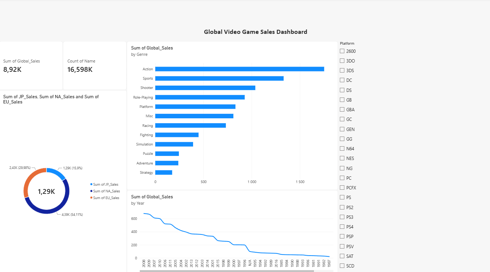

# Video Game Sales Dashboard (Power BI)

A hands-on Power BI project analyzing historical sales data for over 16,500 video games. Built this to explore long-term industry trends, compare platform lifecycles, and see how player tastes change across different parts of the world.

---

## Why I Built This
I love games, and working with gaming data makes analytics fun. But beyond that, I wanted to answer practical business questions that a publisher or market analyst might care about:
- Which genres consistently bring in the most money worldwide?
- When did retail physical game sales peak, and how did platform transitions look?
- Do players in Japan, Europe, and North America actually buy the same types of games? (Spoiler: definitely not).

---

## Tech & Tools Used
- **Power BI Desktop** — report design, interactive visuals, and cross-filtering.
- **Power Query (ETL)** — handling nulls, formatting comma/decimal locale differences, and standardizing data types so all calculations sum up correctly.
- **Data Modeling** — aggregations (total revenue, distinct game counts), dimension slices.

---

## What’s on the Dashboard
1. **Quick KPIs:** High-level overview showing total sales (~8.92B units sold worldwide) and catalog size (16.5K+ releases).
2. **Top Genres by Sales:** Clear ranking of what sells best globally (Action and Sports dominating the leaderboard).
3. **Sales Over Time (Timeline):** Visualizing the rise and peak of the console golden era (PS3 / Xbox 360 / Wii generation between 2007–2010).
4. **Market Share by Region:** Breakdown comparing North America (NA), Europe (EU), and Japan (JP).
5. **Platform Slicer:** Interactive filter on the side to drill down into any console (e.g., PS4, X360, PC, Nintendo DS) and see its specific numbers instantly.

---

## Key Takeaways from the Data
- **Western vs. Japanese Markets:** North America and Europe lean heavily towards Action and Shooters. Japan is a completely different story — Role-Playing games (JRPGs) rule the market, with Nintendo hardware holding huge sway.
- **Action & Sports are the cash cows:** Historically, these two genres generated the largest chunk of total retail revenue.
- **The Physical Sales Peak:** The late 2000s were the absolute peak for retail boxed copies, right before digital storefronts and live-service games started taking over.

---

## Files in This Repo
- `Video_Game_Sales_Dashboard.pbix` — the full Power BI report file (you can open and inspect the queries/visuals).
- `dashboard_preview.png` — screenshot of the final dashboard.
- `vgsales.csv` — dataset used for the project.

---

## How to Open
1. Download or clone this repository.
2. Open `Video_Game_Sales_Dashboard.pbix` in [Power BI Desktop](https://powerbi.microsoft.com/desktop/).
